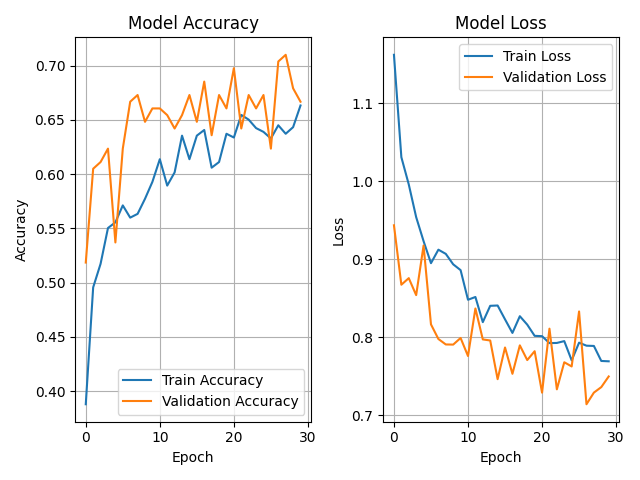
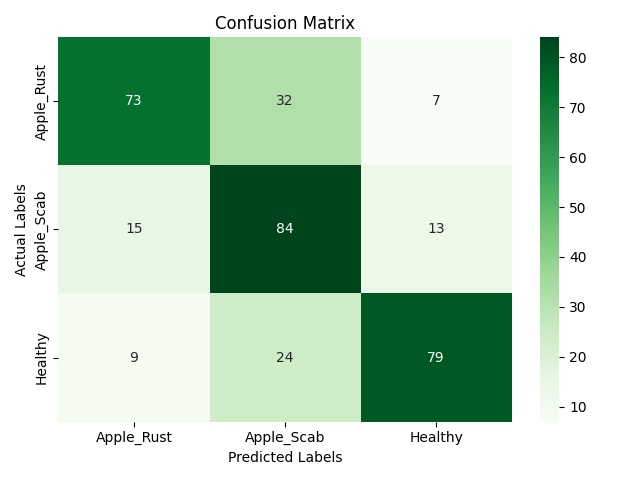

# Apple Disease Classification using MobileNetV2

This project aims to classify apple leaf diseases using digital images and Deep Learning algorithms based on the **MobileNetV2** architecture with a **Transfer Learning** approach. The dataset combines both **Lab Condition** (clean background) and **Field Condition** (natural background) images.

---

## 📁 Project Structure

```
├── data/
│   └── combined/
│       ├── train/
│       ├── val/
│       └── test/
├── models/
│   └── model.h5
├── notebooks/
│   ├── EDA.ipynb
│   └── split_data.ipynb
├── outputs/
│   ├── logs/
│   │   └── train-logs.csv
│   └── metrics/
│       ├── confusion_matrix_v1.png
│       └── classification_report_v1.json
├── src/
│   ├── model.py
│   ├── predict.py
│   ├── preprocessing.py
│   ├── test.py
│   └── train.py
├── class_indices.json
├── requirements.txt
└── README.md
```

---

## 📂 Dataset

The dataset used in this project is a combination of [Lab Condition (PlantVillage)](https://drive.google.com/drive/folders/11p7hWcUP3U83-AFjS7phlHgP2eyRUVcx?usp=drive_link) and [Field Condition (Plant Pathalogy)](https://drive.google.com/drive/folders/1AldXDQvJfyDAJTpVBMmBONbeQMIEDWs8?usp=sharing) apple leaf images.

The dataset is organized into folders by class label (e.g., Apple**_Apple_scab, Apple_**Black_rot, Apple\_\_\_healthy), and has been split into train, val, and test sets for this project.

### Data Example

**Lab Condition:**

.JPG>)

**Field Condition:**

.jpg>)

---

## 📌 Features

- Transfer learning using MobileNetV2 pretrained on ImageNet
- Custom top layers with dropout and dense units
- Evaluation includes accuracy, precision, recall, F1 score (overall & per class)
- Output saved as PNG (confusion matrix) and JSON (metrics)

---

## 🧠 Model Architecture

```python
model = Sequential([
    MobileNetV2(..., include_top=False),
    GlobalAveragePooling2D(),
    Dense(256, activation='relu'),
    Dropout(0.25),
    Dense(num_classes, activation='softmax')
])

model.compile(optimizer=RMSprop(learning_rate=(0.0001)),
                  loss='categorical_crossentropy',
                  metrics=['accuracy', tf.keras.metrics.AUC()])
```

---

---

## 🛠 Requirements

- Python 3.9+
- TensorFlow
- scikit-learn
- NumPy, matplotlib, seaborn

Install all dependencies:

```bash
pip install -r requirements.txt
```

---

## 🚀 How to Use

### 1. Prepare Data

Organize your dataset into `train`, `val`, and `test` folders:

```
combined/
├── train/
│   ├── class_0/
│   ├── class_1/
│   └── class_2/
├── val/
└── test/
```

### 2. Train the Model

Run:

```bash
python src/train.py
```

### 3. Evaluate the Model

Run:

```bash
python src/test.py
```

Results (confusion matrix & metrics) will be saved in `outputs/metrics/`.

---

## 📊 Example Output

- **Accuracy and Loss:**

  

- **Confusion Matrix:**

  

- **Classification Report:** `outputs/metrics/classification_report_v1.json`

```json
{
  "model": "model_v1",
  "timestamp": "2025-04-16T23:25:38",
  "metrics": {
    "overall": {
      "accuracy": 0.7,
      "precision": 0.72,
      "recall": 0.7,
      "f1_score": 0.7
    },
    "per_class": {
      "Apple_Rust": {
        "precision": 0.75,
        "recall": 0.65,
        "f1_score": 0.7
      },
      "Apple_Scab": {
        "precision": 0.6,
        "recall": 0.75,
        "f1_score": 0.67
      },
      "Healthy": {
        "precision": 0.8,
        "recall": 0.71,
        "f1_score": 0.75
      }
    }
  }
}
```

## 🙋‍♂️ Author

Developed by Oki as part of a machine learning portfolio.
Feel free to connect or share feedback!

---

## 📄 License

This project is under the MIT License.
